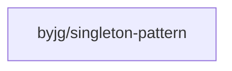

# Singleton Pattern

[](https://github.com/sponsors/byjg)
[](https://github.com/byjg/php-singleton-pattern/actions/workflows/phpunit.yml)
[](http://opensource.byjg.com)
[](https://github.com/byjg/php-singleton-pattern/)
[](https://opensource.byjg.com/opensource/licensing.html)
[](https://github.com/byjg/php-singleton-pattern/releases/)

A lightweight PHP implementation of the Design Pattern Singleton using trait.
Just one class and no dependencies.

## Documentation

- [Getting Started](docs/getting-started.md) - Installation and requirements
- [Creating a Singleton Class](docs/creating-singleton.md) - How to implement the pattern
- [Using Your Singleton](docs/using-singleton.md) - Working with singleton instances
- [How It Works](docs/how-it-works.md) - Implementation details
- [API Reference](docs/api-reference.md) - Complete API documentation

## Requirements

PHP 8.3 or higher

## Installation

```
composer require "byjg/singleton-pattern"
```

## Creating a Singleton Class

```php
<?php
require "vendor/autoload.php";

class Example
{
    // Use the Singleton trait to implement the pattern
    use \ByJG\DesignPattern\Singleton;
    
    // You can add properties to your singleton
    public string $someProperty;
    
    // The constructor MUST be private or protected
    private function __construct()
    {
        // Optional initialization code
        $this->someProperty = "Initial value";
    }
    
    // Add your own methods and properties here
    public function doSomething(): void
    {
        // Your code here
    }
}
```

**IMPORTANT:**
1. Your class MUST use a private or protected constructor.
2. Singleton classes do not accept arguments in the constructor.
3. Attempting to clone, serialize, or unserialize a singleton will throw a `SingletonException`.

## Using your Singleton class

```php
// Get the singleton instance
$example = Example::getInstance();

// The same instance is always returned
$anotherReference = Example::getInstance();
$example->someProperty = "Changed value";

// This will output "Changed value" because both variables reference the same instance
echo $anotherReference->someProperty;

// This will throw a SingletonException
try {
    $cloned = clone $example;
} catch (\ByJG\DesignPattern\SingletonException $e) {
    echo "Cannot clone a singleton!";
}
```

## How It Works

The `Singleton` trait:
- Implements the `getInstance()` static method to create and manage a single instance
- Prevents cloning by overriding the `__clone()` method
- Prevents serialization and deserialization by overriding `__sleep()` and `__wakeup()`
- Uses a static local variable within `getInstance()` to store instances of each class that uses the trait

## Run Tests

```bash
vendor/bin/phpunit
```

## References

* [Wikipedia: Singleton Pattern](https://en.wikipedia.org/wiki/Singleton_pattern)
* [Documentation](docs/getting-started.md)

## Dependencies



----
[Open source ByJG](http://opensource.byjg.com)