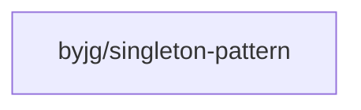

# Singleton Pattern

[](https://github.com/byjg/php-singleton-pattern/actions/workflows/phpunit.yml) 
[](http://opensource.byjg.com) 
[](https://github.com/byjg/php-singleton-pattern/) 
[](https://opensource.byjg.com/opensource/licensing.html) 
[](https://github.com/byjg/php-singleton-pattern/releases/)


A lightweight PHP implementation of the Design Pattern Singleton using trait.
Just one class and no dependencies. 

## Create your class

```php
require "vendor/autoload.php";

class Example
{
    // You need to use the trait here
    use \ByJG\DesignPattern\Singleton;

    // Put your code below
}
```

**REMEMBER:** Your class cannot have a public constructor. If it is necessary, use a private or protected constructor instead. 
Singleton classes does not have arguments in the constructor;

## Use your class

```php
$example = Example::getInstance();
```

## Install

```
composer require "byjg/singleton-pattern"
```

## Run Tests

```
vendor/bin/phpunit
```

## References

* https://en.wikipedia.org/wiki/Singleton_pattern

## Dependencies



----
[Open source ByJG](http://opensource.byjg.com)
